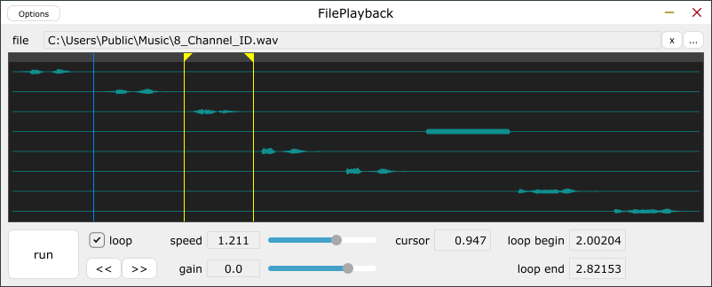

# FilePlayback
 
 

## これ何ですか

オーディオファイルを再生しオーディオ出力を得るためのツールです。プラグインまたはスタンドアロンの形式で動作します。  
JUCE frameworkを利用しています。

## ビルドの道具立て

* JUCE framework: [ダウンロードページ](https://juce.com/get-juce/download)または[githubリポジトリ](https://github.com/juce-framework/JUCE)からダウンロードできます。
* Projucer: JUCE frameworkを使ったC++プロジェクトを生成するツールです。[Projucerページ](https://juce.com/discover/projucer)から実行可能なバイナリをダウンロードできますが、JUCE frameworkに同梱のソースを自分でビルドしても良いです。
* ASIO SDK (optional): Windows版のスタンドアロン形式でASIOを有効化できます。[デベロッパページ](https://www.steinberg.net/developers/)からダウンロードできます。
* C++ビルドツール: Visual Studio 2017～2022、Xcodeなど、目的のターゲットプラットフォームに合わせたもの。

JUCEが対応するプラットフォーム、バイナリ形式、ライセンスについては[JUCE](https://juce.com/)で確認してください。

## ビルドの道のり

1. Projucerで.jucerファイルを開く。
2. Modulesセクションにおいて、ビルド環境に合わせてmoduleパスを修正する。
3. Exporterセクションにおいて、目的のターゲットプラットフォームを追加する。
4. File|Save ProjectメニューでC++プロジェクトを書き出す。
5. Buildsフォルダ下に書き出されたC++プロジェクトをビルドする。

当方では以下の環境でコードを書き、動作を確認しています。
* Windows 11 Pro
* Visual Studio 2022
* JUCE framework 7.0.1
* プラグインホスト: JUCE frameworkに同梱のAudioPluginHostアプリケーション
* VST3、スタンドアロン形式のビルド

MacやLinux、AUやLV2でもビルドできると思います。(要確認)

## 使い方

プラグインやプラグインホストの基本的な知識については、ここでは省きます。

### オーディオファイルの読み込み

オーディオファイルの選択には、「ファイルを開く」ダイアログまたはファイルのドロップが利用できます。  
読み込み可能なフォーマットは、ハンドラクラスjuce::AudioFormatが用意されているものです。WAV、AIFF、FLAC、mp3など主流のフォーマットが読み込めますが、プラットフォームにより相違があります。詳細は[JUCEのドキュメント](https://juce.com/learn/documentation)を参照してください。  

### バスとチャネル割り当て

プラグインは1個の出力バスを持ちます。バスのチャネル数は可変ですが、設定方法はプラグインホストによります。オーディオファイルとバスのチャネル数が異なる場合には、各チャネルのルーティングはfig.1、fig.2のようになります。

 fig.1 オーディオファイルのチャネル数が少ない場合  
 fig.2 オーディオファイルのチャネル数が多い場合  

### プレイバックの操作

|ラベル|ショートカット|機能|
|--|--|--|
|...|　|オーディオファイルをダイアログで開く|
|x|　|オーディオファイルを閉じる|
|run|space|スタート・ストップ|
|<<|alt+←|早戻し|
|>>|alt+→|早送り|
|　|W|巻戻し|
|loop|alt+L|ループのON・OFF|
|speed| |再生速度: x0.5～x2.0　※リサンプリングによるもので、タイムストレッチではありません|
|gain| |再生レベル: off,-60～20 dB|
|cursor| |再生位置: テキスト打ち込み or 波形をクリックまたはドラッグ|
|loop begin/end| |ループ範囲指定: テキスト打ち込み or 黄色い三角をドラック|

## 作者

[yu2924](https://twitter.com/yu2924)

## ライセンス

MIT License
